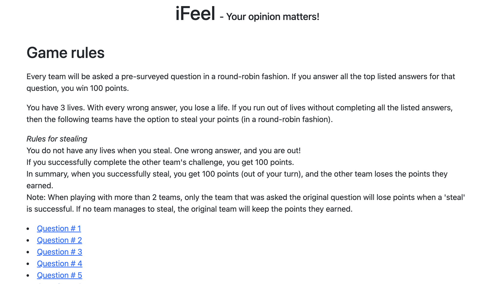
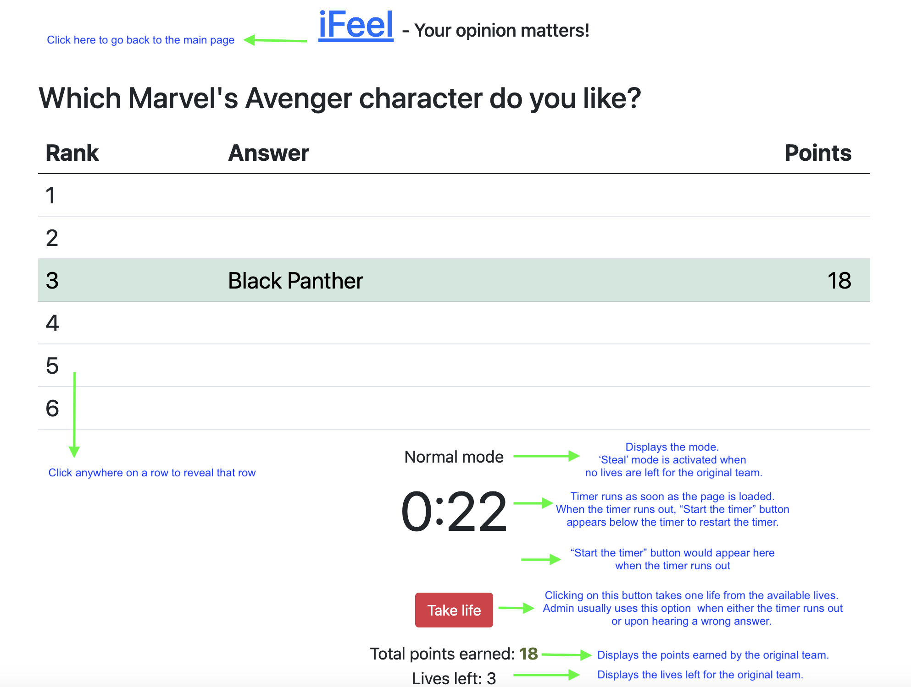

# iFeel - The "Family Feud" game generator 

iFeel is a online variant of the famous "[Family Feud](https://en.wikipedia.org/wiki/Family_Feud)" game show hosted by [Steve Harvey](https://en.wikipedia.org/wiki/Steve_Harvey) (current host at the time of release). And this project helps you host the game easy and fast! 

## Description

Have you ever had to search for team-engagement games? "Family Feud" is a game that could be hosted online. And this project provides you (the gamemaker / moderator / game admin) an easy way to just do that. With minimum pre-requisites / easy ways to add / modify questions you could build your own "Family feud" / iFeel game very fast!


## Getting Started

### Quickstart
* The repo comes with a pre-loaded questions. All you need to do is open index.html and start hosting the game.
* resources/questionbank.csv - this file contains the answers for all the questions and is meant to help the moderator / admin evaluate the answers.

### For the game admin / moderator
* Open output/index.html and present that page to host the game.
* You can find the game rules along with the list of question ids in this page.
* Clicking on a question to start a round. The timer automatically starts as soon as the page loads.
* Use the resources/questionbank.csv for verifying if a given answer is up in the leaderboard.
* Click anywhere on the row matching the rank of the answer to reveal it.
* Use "Take life" button to reduce the lives left by 1.
* When all the lives are over, the question is open for stealing and the same would be indicated by the following indicator.

### Screenshots
* Home page
 
* Questions page


### Dependencies

* Python 3 (any version)
* Works with any Linux / Mac OS (Yet to test the path conventions in PC)
* Good to have a .csv reader like Microsoft Excel / LibreOffice Calc; Google sheets could also be used

### Installing

* Download and install Python from the [official Python website](https://www.python.org/downloads/)

### Executing program

* Edit the questionbank.csv file with the questions for the game and save the file. 
* Run src/main.py as follows
```
python3 src/main.py
```
* Now open the output/ folder and verify if new HTMLs are generated
* The questionbank.csv file is expected to be used by the moderator / admin to check and reveal the answers
* Open "index.html" and you are good to host the game!

## Configurations
* If you want to increase / decrease the timer and lives, edit the the following lines as needed in output/js/custom.js
```
const TIMER = "0:30";
const INIT_TIMER = "0:47";
var livesLeft = 3;
```
## Acknowledgments

* [Family feud questions](https://parade.com/1188030/marynliles/family-feud-questions/)

## Limitations
* The game moderator needs to take life every time the timer runs out. Lives will not be deducted automatically upon timer expiry.
